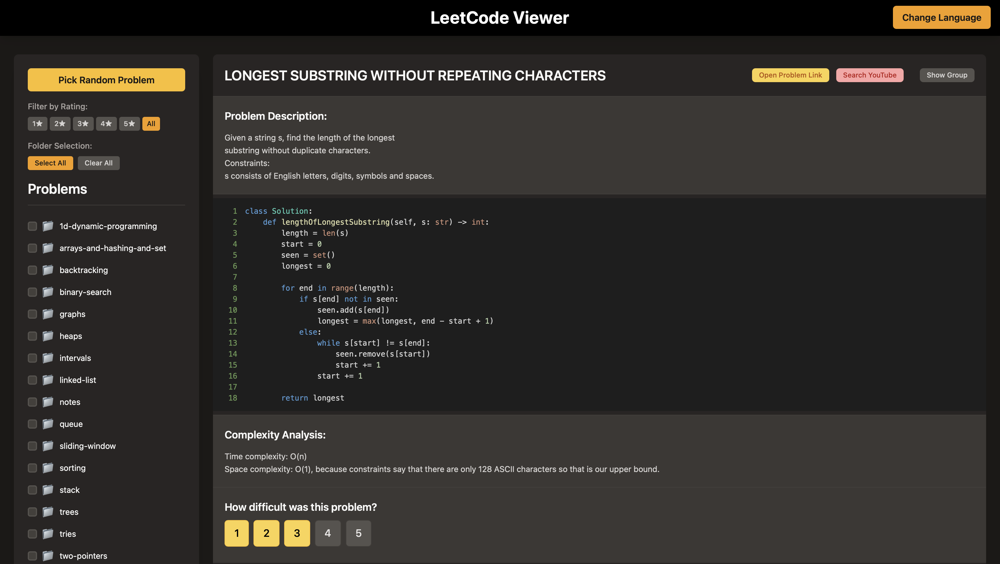

# leetcode-viewer

A web application used to visualize, rate, and study your LeetCode solutions.



## Features

*   Browse your LeetCode solution files structured by their original directory layout.
*   View problem descriptions, code, and complexity analysis (extracted from comments in your solution files).
*   Rate your solutions on a scale of 1-5 (higher ratings get showed more frequently).
*   Link directly to the LeetCode problem page.
*   Random problem selection for practice.

## Prerequisites

Before you begin, ensure you have the following installed:

*   **Docker:** [Install Docker](https://docs.docker.com/get-docker/)
*   **Docker Compose:** (Usually included with Docker Desktop) [Install Docker Compose](https://docs.docker.com/compose/install/)
*   **Git:** For cloning the repositories.
*   **Your LeetCode Solutions Repository:** You need a local copy of your LeetCode solutions. This project expects them to be Python files (`.py`).

## Setup Instructions

1.  **Clone this Repository:**
    ```bash
    git clone https://github.com/your-username/leetcode-viewer.git # Replace with your actual repo URL
    cd leetcode-viewer
    ```

2.  **Clone Your LeetCode Solutions Repository:**
    You will need your LeetCode solutions repository. You can find the one this project is configured for at [https://github.com/EngineerAlexander/leetcode](https://github.com/EngineerAlexander/leetcode).
    Clone it alongside the `leetcode-viewer` directory.

    This project expects your LeetCode solutions to be located in a directory structure *relative to the `leetcode-viewer` project folder*.

    Specifically, if the `leetcode-viewer` project is cloned into a directory, say `~/projects/leetcode-viewer`, the application by default looks for Python solutions in `~/projects/leetcode/python/`.

    Therefore, you should clone your LeetCode solutions repository *alongside* the `leetcode-viewer` directory and ensure your Python solutions are within a `python` subdirectory of that repository.

    **Example Directory Structure:**
    ```
    your_workspace_directory/
    ├── leetcode-viewer/       # This project
    │   ├── backend/
    │   ├── frontend/
    │   ├── docker-compose.yml
    │   └── ...
    └── leetcode/              # Your LeetCode solutions repository
        ├── python/
        │   ├── array/
        │   │   └── two-sum.py
        │   ├── string/
        │   │   └── reverse-string.py
        │   └── ...
        └── ... (other languages or files)
    ```

    If your LeetCode solutions Python files are in a different relative path, you will need to adjust the `SOLUTIONS_DIR` variable in `backend/main.py` and the corresponding volume mount in `docker-compose.yml` for the `backend` service:

    In `docker-compose.yml`:
    ```yaml
    services:
      backend:
        volumes:
          # ... other volumes
          - /path/to/your/actual/leetcode/python/solutions:/leetcode/python # Adjust this line
    ```
    And in `backend/main.py` (though the Docker volume mount is usually sufficient if the container path `/leetcode/python` remains the target):
    ```python
    SOLUTIONS_DIR = Path("/leetcode/python") # If you keep the container path consistent
    ```
    However, the default setup assumes the `../leetcode/python` structure from the perspective of the `leetcode-viewer` project root, mapped into the container.

## Running the Application with Docker Compose

Once the repositories are set up correctly:

1.  **Navigate to the `leetcode-viewer` project root directory:**
    ```bash
    cd /path/to/your_workspace_directory/leetcode-viewer
    ```

2.  **Build and Run the Docker Containers:**
    ```bash
    docker-compose up --build
    ```
    *   The `--build` flag ensures images are built (or rebuilt if Dockerfiles have changed).
    *   Remove `--build` for subsequent runs if you haven't changed the Dockerfiles or dependencies significantly.

3.  **Accessing the Application:**
    *   **Frontend (Web Interface):** Open your browser and go to `http://localhost:5173`
    *   **Backend API (for direct access or debugging):** The API is available at `http://localhost:8000`. For example, `http://localhost:8000/solutions`.

4.  **Stopping the Application:**
    *   Press `Ctrl+C` in the terminal where `docker-compose up` is running.
    *   To stop and remove the containers, you can run: `docker-compose down`

## Development Environment (VS Code Dev Containers)

This project is configured for use with VS Code Dev Containers, providing a consistent and fully set up development environment.

*   **Backend Development:** Open the project in VS Code. It should prompt you to "Reopen in Container." Choose this option. It will use the `.devcontainer/devcontainer.json` configuration to set up the Python environment for the backend.
*   **Frontend Development:** If you want a dedicated dev container for the frontend, you can use the "Dev Containers: Open Folder in Container..." command from the Command Palette and select the `.devcontainer/devcontainer-frontend.json` configuration file.

This makes it easy to get started with development without needing to install Python, Node.js, or other dependencies directly on your host machine.

## File Structure for Solutions

The backend parses solution files (`.py`) expecting a certain structure:

1.  **Source Link:** Generated from the name of the .py file of the solution. For example, two-sum.py maps to `# https://leetcode.com/problems/two-sum/`
2.  **Description:** Comment lines (`# ...`) at the beginning of the file (after the optional source link, if any, and before the first line of actual code) are considered the problem description.
3.  **Code:** The first contiguous block of non-comment lines is treated as the solution code.
4.  **Complexity:** Comment lines (`# ...`) immediately following the code block are treated as the complexity analysis.

